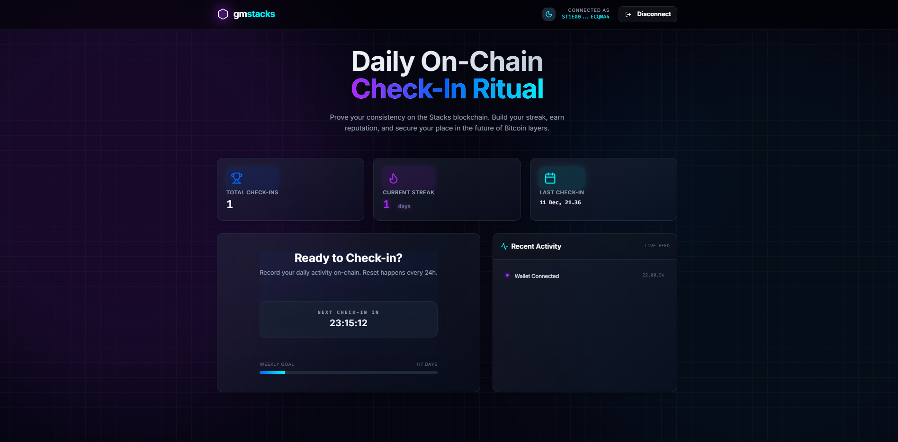

# gmstacks Frontend 🎨

React dApp for interacting with `gmstacks` smart contract.

## Quick Start

```
npm install
npm run dev
```

## Build & Deploy

```
npm run build
npm run preview
```


**Vercel**: Connect GitHub repo → auto-deploy on push.

## Environment

Update `stacksConfig.ts`:
```
export const CONTRACT_ADDRESS = 'ST1E00WKNW3PY8N3MB5F83AAT0QWWHVFK21ECQMA4';
export const CONTRACT_NAME = 'gmstacks';
```

## Features

- Auto-connect wallet after refresh
- Real-time 24h countdown
- Dark/Light theme
- Responsive design
- TailwindCSS + custom components

## Scripts

```npm run dev # localhost:5173
npm run build # production build
npm run lint # ESLint
npm run preview # local preview
```

## Components

```
src/
├── components/
│ ├── GlassCard.tsx
│ ├── NeonButton.tsx
│ ├── StatsGrid.tsx
│ └── ActivityFeed.tsx
├── stacksClient.ts # Web3 calls
└── App.tsx
```


## Dependencies

```
@stacks/connect # Wallet
@stacks/transactions # Clarity types
lucide-react # Icons
tailwindcss # Styling
```

**Live Demo**:

